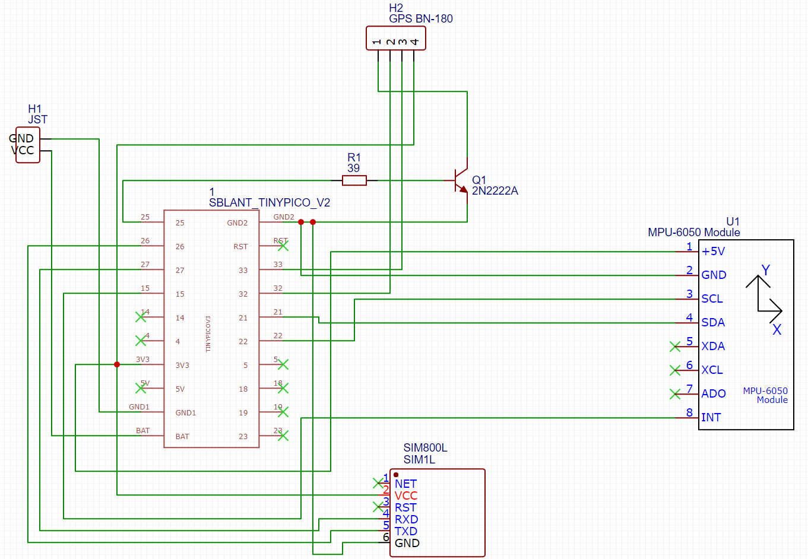
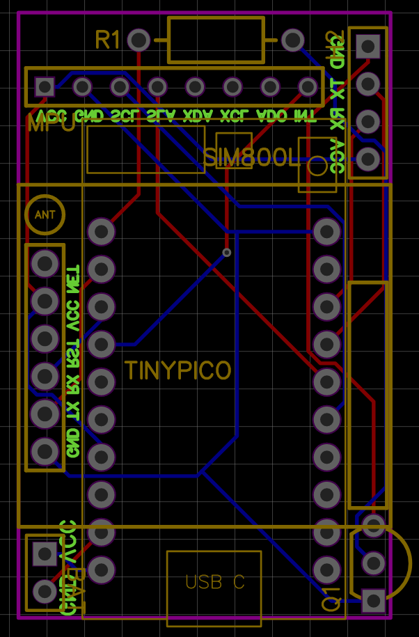
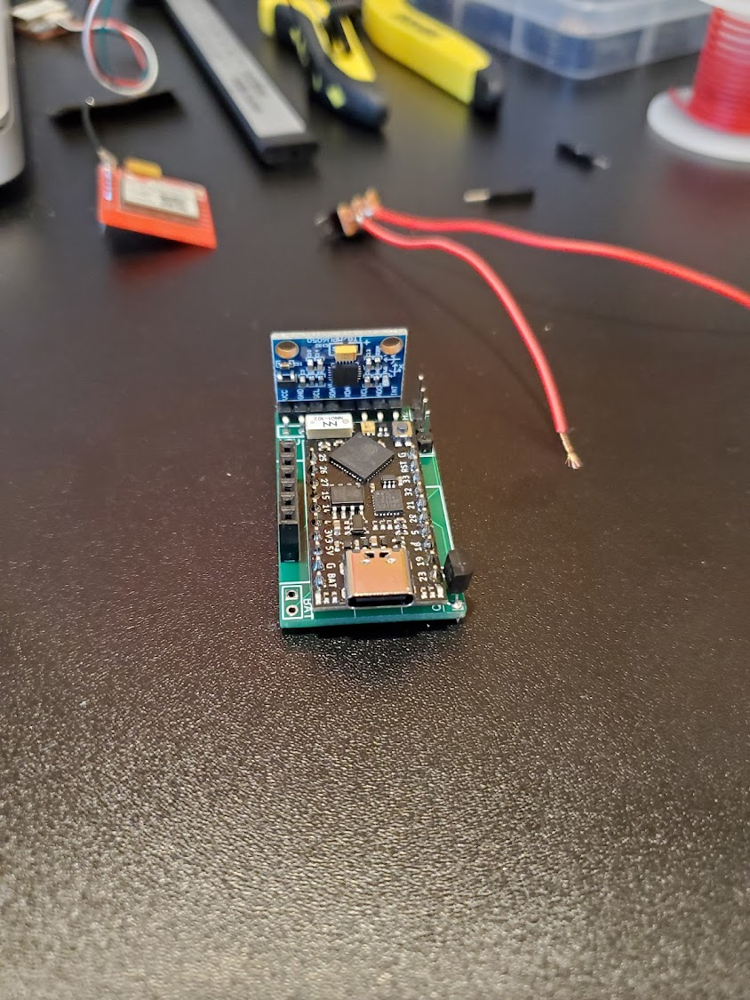
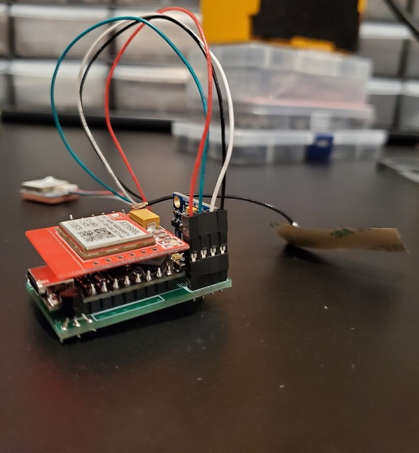
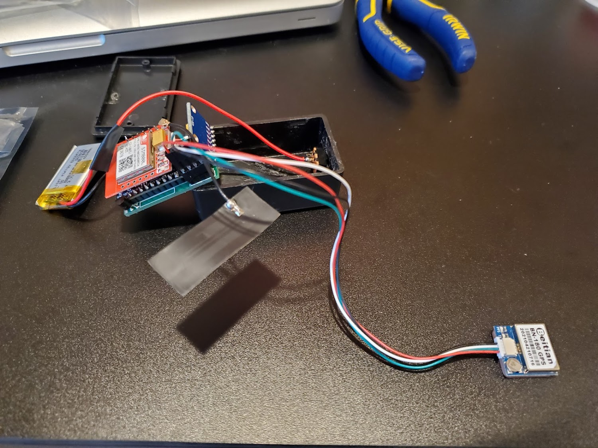
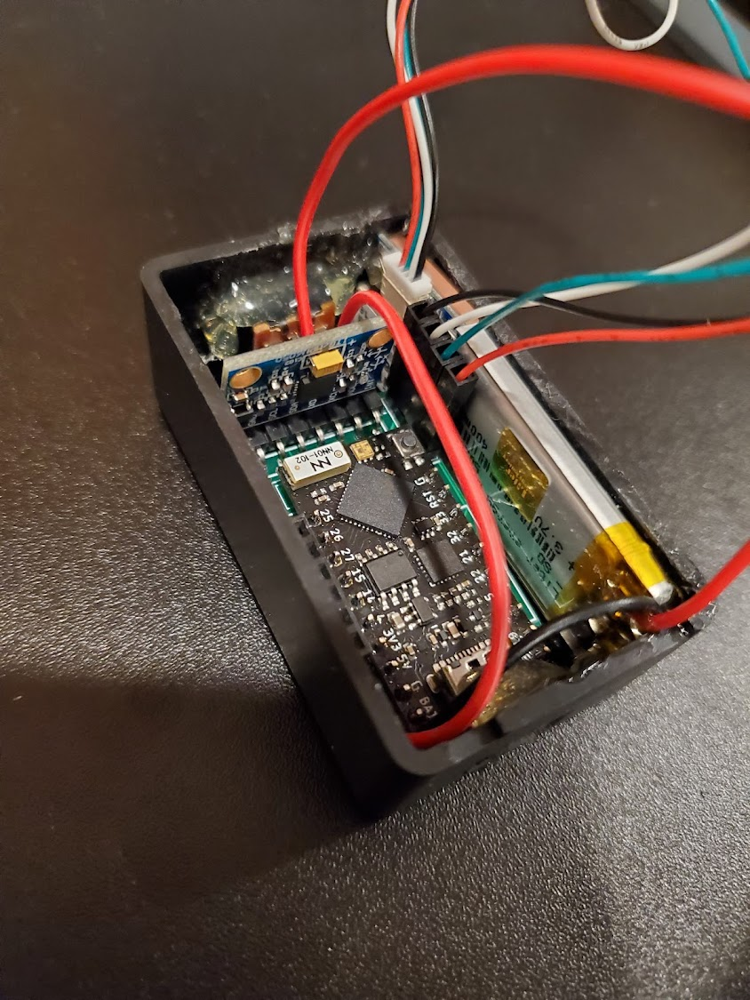
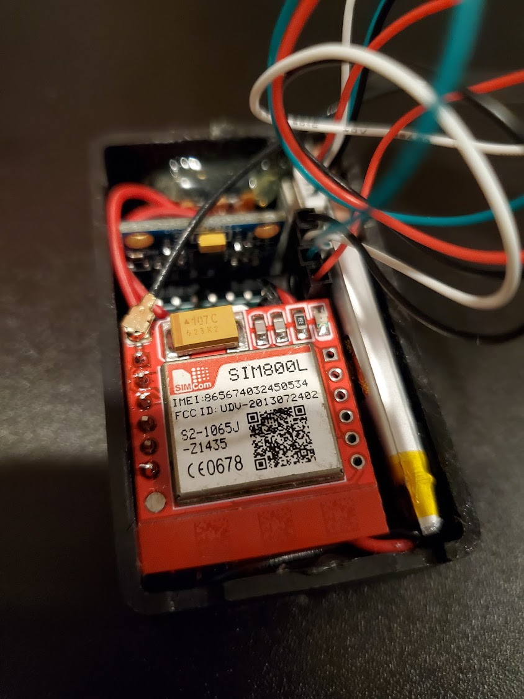

# Smol 'n Sensitive GPS Tracker
A small GPS tracker that uses both cell tower and GPS location tracking based off of GPS satellite availability.

## Functionality
This is a small GPS tracker that initially attempts to pull GPS coordinates after the module warms up. If that fails to resolve any satellites, it will leverage the SIM800L to pull the coordinates of the connected cell tower. Once it sends the coordinates via HTTPS to the desired server, it will then go into ESP32's deep sleep mode with the GPS module switched off with a transistor, and the MPU accelerometer will remain powered to a low degree (gyro disabled). Once the MPU senses motion, it will power the device back on, leaving deep sleep mode, and send the current coordinates again.

Schematic and wiring diagram: https://easyeda.com/testuser123456/gps-tracker

## Parts
- TinyPICO
  - https://www.amazon.com/gp/product/B0917V5YL3/ref=ppx_yo_dt_b_search_asin_title?ie=UTF8&psc=1
- 400mAh LiPo battery, 5mm * 20mm * 35mm (H * W * L)
  - https://www.amazon.com/dp/B09F9W7Z6J?psc=1&ref=ppx_yo2_dt_b_product_details
- Project Box Black 2.4 x 1.4 x 1 inch (61 x 36 x 25 mm)
  - https://www.amazon.com/dp/B07D23VBNT?psc=1&ref=ppx_yo2_dt_b_product_details
- BN-180 GPS Module
  - https://www.amazon.com/dp/B078Y4XZN9?psc=1&ref=ppx_yo2_dt_b_product_details
- Gy-521 MPU-6050
  - https://www.amazon.com/dp/B008BOPN40?psc=1&ref=ppx_yo2_dt_b_product_details
- HiLetgo Smallest SIM800L GPRS GSM Breakout Module
  - https://www.amazon.com/dp/B01DLIJM2E?psc=1&ref=ppx_yo2_dt_b_product_details
- 2N222A transistor
- 200ohm resistor

## Code location
- tinypico_gsm_tracker_with_mpu.ino on TinyPICO
- index.php wherever on your web server
- parser.php wherever on your web server and accessible by your TinyPICO to receive POST requests

## Details/Explanation

The TinyPICO was selected for its small size, general affordability, being an ESP32 module which supports "deep sleep mode", charging of an attached battery via USB-C, and 3.3V support. By using the ESP32, I was able to leverage the code from here https://github.com/Crypter/MotionDetector/blob/master/MotionDetector.ino, which was rewritten from the original version in ESP32 to Arduino code, which allows for putting the ESP32 to deep sleep mode and woken up by the MPU on the interrupt pin when it is slightly moved.

400mAh LiPo battery with the above-mentioned dimensions were for just enough battery life to last a good while, and still fit in the project case.

I chose the BN-180 GPS module due to its small size, 3.3V support, and relatively low bandwidth. The presence of the 2N222A transistor and 200ohm resistor acts as a switch to disconnect the ground wire before the device goes into deep sleep mode, cutting wasted power consumtpion to the module. 

I selected this particular Gy-521 MPU-6050 due to its low power consuption, modifiable registers which allow for disabling power consuming features that are not needed, and the interrupt pin for waking up based off of movement.

The HiLetgo Smallest SIM800L GPRS GSM Breakout Module was selected due to its price point and size. However, I made this modular so that it should be easy enough to swap for NB-IoT should that pricepoint lower.

**Schematic**

**Wiring Diagram**

**Pictures of the Build**

